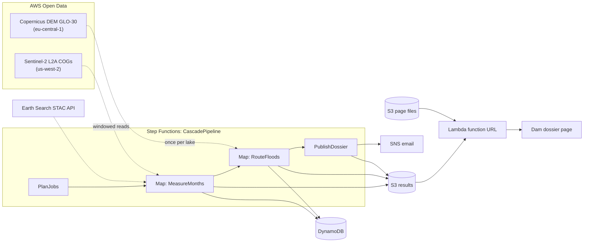

# CASCADE: Glacial Lake Outburst Flood Telemetry & Early Warning System
*Built during WeMakeDevs x AWS Environmental Hacks — Track 02: Heat and Water*

[](https://github.com/suryaprasanthcse/CASCADE-GLOF-Telemetry/actions/workflows/ci.yml)

CASCADE tells the people responsible for a dam below a glacial lake how much water an outburst would send them, and how soon. It measures the lake from Sentinel-2 satellite images, routes the flood down the valley, and publishes a dam dossier on AWS. The demo replays the October 2023 South Lhonak flood, which destroyed the Teesta-III dam.

**Dam dossier page:** https://hwpbqzkcdkak5m5xmswijmmmfi0snuis.lambda-url.us-west-2.on.aws/

## The problem

On the night of 3 October 2023, the moraine dam holding South Lhonak Lake in north Sikkim collapsed. Seismic records date the collapse to 22:12 IST. About 50 million m³ of water drained from the lake. Around 00:30 IST it reached the 1,200 MW Teesta-III dam at Chungthang, 67.5 km downstream, and destroyed it.

A dam safety officer below a glacial lake needs two answers before that happens: how much water could come, and how long it takes to arrive.

## What CASCADE does

1. **Measures the lake** from Sentinel-2 imagery, month by month. Cloud, snow, slush and shadow are masked, and the area is reported as a range whenever part of the lake is hidden.
2. **Traces the flood path** from the lake to the dam on the Copernicus 30 m elevation model.
3. **Routes the flood** down that path with a mass-conservative, variable-parameter Muskingum–Cunge model.
4. **Publishes a dam dossier:** arrival time, peak flow, depth and warning time. It is shown on a public page built for the dam officer, with a print-to-PDF version.

The full design, the validation rules and every change made while building are in [docs/architecture-brief.md](docs/architecture-brief.md).

## How it runs on AWS



- **AWS SAM** (open source) defines and deploys everything as one stack in us-west-2. See [template.yaml](template.yaml).
- **Lambda:** four functions (plan, measure, route, report) run from one container image in **ECR**, with Python 3.14 and rasterio/GDAL.
- **Step Functions:** a Standard workflow runs them, fanning out one Map item per lake-month.
- **S3 and DynamoDB** hold the results. **CloudWatch Logs** keeps the logs for 90 days.
- **A Lambda function URL** serves the dossier page from a private bucket, together with the published results. It can read only those results. CloudFront was the plan, but AWS requires a new account to be verified before it can use CloudFront.
- **SNS** emails each new dossier. A **$20 AWS Budgets** alert (counting spend before credits) and a **CloudWatch alarm** on failed runs send to the same topic.
- **IAM:** each function has its own least-privilege role.
- **Data:** Sentinel-2 images are read window by window in the same region, with no full downloads. The elevation model is read once per lake and cached in S3.

## Results of the 2023 replay

| Check | CASCADE | Published | Note |
|---|---|---|---|
| Lake area before the flood (14 Sep 2023) | 164.4 ha | 167.4 ha (ISRO/NRSC) | −1.8% |
| Flow path, lake to Chungthang | 66.21 km | 67.5 km | −1.9% |
| Water balance of the routing | exact | | water in equals water out |
| Flood arrival at Teesta-III | 00:30 IST | about 00:30 IST | Calibrated: Manning's *n* = 0.175 was fitted to this arrival, so it is not an independent test |
| Peak flow at the dam | 10,541 m³/s | 5,340 m³/s (Sattar et al.); about 7,355 m³/s (*Natural Hazards*, 2025) | 1.4–2× too high |
| Lake area after the flood (29 Oct 2023) | 1.21–1.46 km² | | A range, because snow and ice hid 14% of the lake |

**How the calibration went:**
- The pass/fail limits were fixed before the first run: *n* had to land between 0.03 and 0.20.
- **First run:** formula-based flood sources needed *n* = 0.216, so the test failed, and it was kept as a fail.
- **Model change:** the source was then switched to Sattar et al.'s published reconstruction of the lake's outflow. The writeup says so.

Details are in [docs/architecture-brief.md §4.5](docs/architecture-brief.md).

## Cloud performance and determinism: 2023 South Lhonak hindcast on AWS

Raw AWS records and the scripts that rebuild these tables: [`evidence/2026-10-08-batch/`](evidence/2026-10-08-batch/).

**Test setup:**
- **Deployment:** stack `cascade-glof` (us-west-2), Lambda container images (Python 3.14, x86_64), orchestrated by a Step Functions Standard workflow.
- **Input:** every run used the same input, `events/hindcast-2023.json`, covering September–October 2023 for South Lhonak Lake.
- **Runs:** on 8 Oct 2026 we ran **60 executions back to back**, after 2 earlier manual executions. All 62 succeeded.

### End to end (one Step Functions execution)

| Condition | Runs | Median | 95% CI of median | IQR | p95 | Max |
|---|---:|---:|---|---|---:|---:|
| **Warm** (environments reused) | 59 | **7.1 s** | 7.0–7.2 s | 6.8–7.5 s | 8.0 s | 8.2 s |
| Cold, image already cached | 2 | 18.6 s and 23.4 s | – | – | – | – |
| Cold, first load after deploy | 1 | 81.2 s | – | – | – | – |

The warm median held steady across the four blocks of 15 runs: 7.2 s, 7.2 s, 7.1 s and 6.8 s. The coefficient of variation was 6.7%.

### Per Lambda function (batch runs)

| Function | Memory | Warm invocations | Warm median (95% CI) | Warm p95 | Warm max | Cold-start invoke time | Peak memory used |
|---|---:|---:|---|---:|---:|---|---:|
| plan | 512 MB | 59 | 0.002 s (0.002–0.002) | 0.002 s | 0.003 s | 0.002 s | 161 MB |
| measure (one lake-month) | 3008 MB | 118 | **5.55 s** (5.47–5.73) | 6.74 s | 7.03 s | 10.0–11.7 s | 405 MB |
| route (lake → dam) | 2048 MB | 59 | 0.473 s (0.471–0.475) | 0.519 s | 0.545 s | 0.81–0.97 s | 194 MB |
| report | 512 MB | 59 | 0.179 s (0.175–0.185) | 0.234 s | 0.252 s | 0.73–0.77 s | 184 MB |

CloudWatch recorded 60 plan, 120 measure, 60 route and 60 report invocations over the batch, with **0 errors and 0 throttles**. The Lambda logs show at most 2 invocations running at once. That's well under the account's concurrency limit, which was 10 at the time; the limit is an account setting, so it isn't in the evidence.

### Cold starts

| Kind | Observations | Startup (Lambda init) |
|---|---|---|
| First load of a newly deployed image | 1 run, 5 invocations | **4 of 5 hit Lambda's 10 s init limit.** Lambda re-ran the startup inside the invocation; nothing failed. |
| Image already cached by Lambda | 3 runs, 11 invocations | 1.0–3.3 s, with no timeouts |

### Physics parity across all 60 batch runs

| Output | Reference (local run) | All 60 batch runs | Distinct values |
|---|---|---|---:|
| September scene, status | 2023-09-14, best | 2023-09-14, best | 1 |
| September lake area | 1.6438 km² (high 1.6543) | 1.6438 km² (high 1.6543) | 1 |
| October scene, status | 2023-10-29, range | 2023-10-29, range | 1 |
| October lake area range | 1.2063–1.4636 km² | 1.2063–1.464 km² | 1 |
| Flood arrival at Teesta-III | 00:30:00 IST (benchmark ~00:30) | 00:30:00 IST | 1 |
| Peak flow / depth at the dam | 10,541 m³/s / 15.9 m | 10,541 m³/s / 15.9 m | 1 |
| Warning time | 137.7 min | 137.7 min | 1 |

The October high end differs from the local run by 0.0004 km². The first cloud run grew the stored lake footprint, which moved the October range from 1.2061–1.4634 km² in that run to 1.2063–1.464 km² in every run since. Every run since then has produced identical outputs. We measured the added area at about 330 m², but each run overwrites the footprint file, so that measurement isn't in the evidence.

### What these numbers do and don't show

- **Determinism.** Zero divergent outputs in 60 runs puts the probability of any one run diverging below **4.9%** at 95% confidence (1 − 0.05^(1/60)). The code has no random inputs. Repeated runs can't *prove* determinism; they can only fail to find a counterexample.
- **Tail latency.** With 59 warm runs, the slowest run (8.2 s) is a 95% upper bound for warm p95 (1 − 0.95⁵⁹ = 0.952). That's why the batch had 60 runs rather than 20: with 20, the slowest run would be only a 64% bound. Medians use distribution-free confidence intervals from order statistics.
- **Warm runs flatter real use.** Each warm run re-reads the same satellite image windows, and GDAL's in-memory HTTP cache probably serves part of them. A real run on new scenes will sit closer to the cold invoke times, about 10–12 s per lake-month.
- **Cold starts are few.** Three cold runs are enough to show the pattern, not a distribution. Sampling more needs runs spaced 20–30 minutes or more apart, or a redeploy.
- **The stored footprint drifts.** Its outline changes at the floating-point level on every run (45 of 45 hashed runs), without changing any output. After the last run the stored file had 449 vertices (17.9 KiB), the same size as in our earlier checks. The bucket keeps no old versions, so the evidence can't show the size over time.
- **One case study.** All of this is one lake and one event, the 2023 South Lhonak flood.

**Cost:** 2,094 GB-s of Lambda time, 300 requests and about 7 state transitions per run comes to **$0.0455 for the 60 runs** ($0.00076 per run) at on-demand prices, inside the AWS free tier.

## Run it yourself

You need Python 3.14, Docker, the AWS SAM CLI and an AWS account. These commands run from the repo root; on Windows, use `.venv\Scripts\python`.

**Test and lint:**

```bash
python -m venv .venv
.venv/bin/python -m pip install -r requirements-dev.txt
.venv/bin/python -m pytest
.venv/bin/cfn-lint template.yaml
```

**Deploy:** `samconfig.toml` holds the stack settings. Run `sam deploy --guided` the first time, and `sam deploy` after that.

```bash
sam build
sam deploy --guided
```

**Re-run the 2023 replay on AWS:**

```bash
sam remote invoke CascadePipeline --stack-name cascade-glof --region us-west-2 --event-file events/hindcast-2023.json
```

**Publish the dossier page:** take the bucket name from the stack output `SiteBucketName`. The page is then live at the `SiteUrl` output.

```bash
python -m tools.site.make_lake_images --lake south_lhonak --scene S2A_T45RXL_20230914T044830_L2A --scene S2B_T45RXL_20231029T045728_L2A --out web/img
aws s3 sync web/ s3://SITE_BUCKET/ --delete
```

**Get the alerts:** subscribe an email address to the stack output `AlertTopicArn`, then click the confirmation email. The address stays out of the repo.

```bash
aws sns subscribe --topic-arn ALERT_TOPIC_ARN --protocol email --notification-endpoint you@example.com
```

**Rebuild the benchmark tables from the published evidence:**

```bash
python -m tools.benchmark.analyze evidence/2026-10-08-batch --check-readme README.md
```

This needs only standard Python, with no AWS access.
- It checks every evidence file against its manifest.
- It rebuilds the tables.
- With `--check-readme`, it fails if any README row or figure doesn't match.

CI ([`.github/workflows/ci.yml`](.github/workflows/ci.yml)) runs this on every push, together with the tests, the PEP 8 check and the template lint.

## Limits

- **Scope:** it's a screening tool, not engineering design. It covers one lake, one dam and one event.
- **Arrival time:** it is calibrated, and the peak flow runs 1.4–2× above the published reconstructions (see the results table).
- **Missing physics:** the 30 m elevation model and 1D routing miss valley storage, and the model leaves out sediment and debris. Both likely explain the high peak. It also reaches the ITBP camp, 7 km down the valley, about 5 minutes early.
- **Warning time** assumes the burst is detected at the lake the moment it happens.
- **Unverified inputs:** the test that the peak falls inside 5,340–14,673 m³/s leans on an unverified upper bound. The peak-flow formula coefficients, used only for the failed first calibration, are still to be checked against the original papers.

## Credits and licences

**Data**
- **Sentinel-2:** contains modified Copernicus Sentinel data [2023]. It was read from the Sentinel-2 L2A COGs on the [Registry of Open Data on AWS](https://registry.opendata.aws/sentinel-2-l2a-cogs/), found through Element 84's [Earth Search](https://earth-search.aws.element84.com/v1) STAC API.
- **Copernicus DEM GLO-30:** produced using Copernicus WorldDEM-30 © DLR e.V. 2010-2014 and © Airbus Defence and Space GmbH 2014-2018 provided under COPERNICUS by the European Union and ESA; all rights reserved. It was read from the [Registry of Open Data on AWS](https://registry.opendata.aws/copernicus-dem/).
- **Map relief on the dossier page:** [Terrain Tiles](https://registry.opendata.aws/terrain-tiles/) (Mapzen) on the Registry of Open Data on AWS. For this region:
  - Global ETOPO1 terrain data U.S. National Oceanic and Atmospheric Administration.
  - Global GMTED2010 and SRTM terrain data courtesy of the U.S. Geological Survey.
  - The full list is [here](https://github.com/tilezen/joerd/blob/master/docs/attribution.md).

**Published figures**
- **Sattar et al. (2025):** "The Sikkim flood of October 2023: drivers, causes and impacts of a multihazard cascade", *Science* 387, doi:10.1126/science.ads2659 (accepted manuscript under CC BY: [White Rose eprint 224098](https://eprints.whiterose.ac.uk/id/eprint/224098)). Used for:
  - the reconstructed lake outflow (Fig. 3D, digitised by eye);
  - the release time;
  - the drained volume;
  - the Chungthang peak of 5,340 m³/s.
- **ISRO/NRSC:** the pre-flood lake area of 167.4 ha, as reported by the Deccan Herald.
- **Global Energy Monitor:** the location of the Teesta-III dam.
- **D. Petley, *The Landslide Blog* (Eos):** a cross-check of the release time.
- ***Natural Hazards* (2025), doi:10.1007/s11069-025-07350-9:** about 7,355 m³/s at Chungthang.

**Methods**
- **Muskingum–Cunge routing:** Ponce's formulation, made mass-conservative following Todini (2007).
- **Peak-flow formulas:** Huggel et al. (2002), Evans (1986) and Popov (1991).

**Software**
- The Python libraries in the requirements files, each under its own licence.
- AWS SAM CLI.
- [MapLibre GL JS](https://maplibre.org/) 4.7.1 (BSD-3-Clause), which draws the map on the dossier page.

## Licence

The code and documentation in this repository are under the [MIT licence](LICENSE). Data, figures and numbers from others keep their own licences, listed above.

## AI tools used

As the hackathon rules require, these are the AI coding tools used to build this project:

- **Claude Code** (Anthropic): used throughout the build to write and review code, run the AWS deployment and benchmark commands, analyse results and draft documentation.
