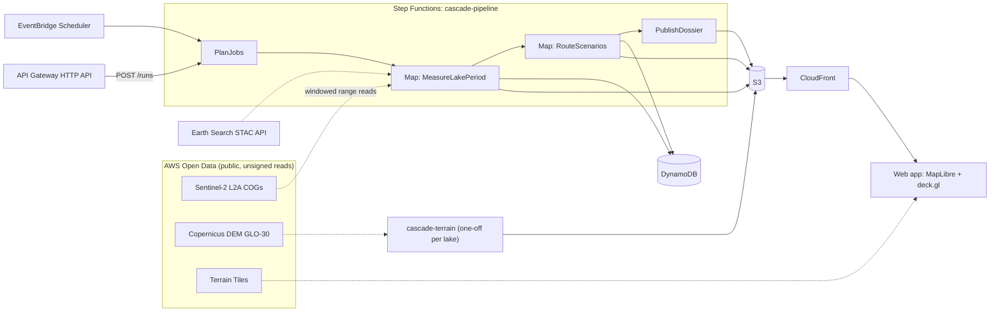

# CASCADE architecture brief

**Proposal v1, for team review.** Prepared 8 Oct 2026, day 1 of the event. No code has been written yet.

All code will be written fresh in this repository. The September practice run informs the decisions below, but none of its code is reused.

---

## 0. The build in one paragraph

CASCADE answers one question for one user. A dam safety officer at Teesta-III asks: *"If a glacial lake above my dam bursts tonight, how much water reaches the dam, and when?"* CASCADE measures each upstream lake from Sentinel-2 satellite images. It estimates the flood the lake could release and routes that flood down the valley. Every number comes out as a range, never as one confident figure. The demo proves the engine by re-running the October 2023 South Lhonak flood against published figures.

**Recommended scope:** build South Lhonak → Teesta-III end to end first. Add other lakes only after the acceptance tests in section 4 pass.

### What the practice run taught us

| Finding from the September run | What it changes in this design |
|---|---|
| Reading just the lake window from each image takes about 1–2 s per band, with no full-scene downloads | Per-lake Lambda jobs are cheap, and nothing has to be copied first |
| The tile-wide `eo:cloud_cover` misleads: Sep 6 showed 29% for the tile but 45% over the lake area | Cloud and snow are scored over each lake's own footprint |
| Earth Search pixels already have the offset removed, but the metadata still lists `offset: -0.1` | Respect `earthsearch:boa_offset_applied`, and add a sanity check on pixel values |
| One acquisition can appear as several items with different cloud layers (Sep 14: `_0` showed 5% cloud, `_1` showed 31%) | Keep one item per acquisition, and use the cloud layer for clouds only |
| NDWI can't tell snow or slush from water (snow-flagged pixels read NDWI 0.15–0.37) | Add a near-infrared test, and report area as a range |
| Post-flood open water depends on the date (0.37 km² on Oct 6, 1.30 km² on Oct 29) | Pick the best scene each month, and skip months where too much of the lake is hidden |
| The lake starts icing over by Oct 31 | Measure in the ice-free season, and flag frozen months |
| Flood routing was never tested | It's the biggest risk, so it gets a go/no-go check on Day 2 |

---

## 1. AWS architecture

### 1.1 Design rules

- **Region us-west-2.** The Sentinel-2 image files are stored there, so reads from Lambda are fast and same-region transfer is free.
- **Heavy terrain work runs once per lake.** Lake monitoring and flood scenarios run on a schedule or on demand.
- **Precompute, then serve static files.** Results are written as JSON and served through CloudFront. The API exists only to start runs and report their status.
- **One Python package.** The same code runs on a laptop and in Lambda; only the entry points differ.
- **No decorative services.** Every AWS service that appears in the video does real work.

### 1.2 Overview

### 1.3 Components

| Service | Job | Notes |
|---|---|---|
| AWS Open Data: Sentinel-2 L2A | Satellite images | Found through Earth Search; only the window around each lake is read |
| AWS Open Data: Copernicus DEM GLO-30 | Elevation for flood routing | Read once per lake; derived products stored in our bucket |
| AWS Open Data: Terrain Tiles | 3D terrain in the browser | Terrarium PNG tiles, no API key |
| Lambda (container image in ECR) | `measure`, `terrain_prep`, `route`, `report` | One image with rasterio/GDAL, pysheds and matplotlib, plus one handler per function. arm64 if every wheel exists, otherwise x86_64 |
| Lambda (zip) | API handler | Starts a run, reports status |
| Step Functions (Standard) | Orchestration | The Map fan-out is visible in the console, which is the "AWS" shot in the video |
| EventBridge Scheduler | Weekly run in the ice-free season | Sentinel-2 revisits every few days |
| DynamoDB (on-demand) | Results we query | A single table, keys in 1.5 |
| S3 | Files and the static site | Private bucket, read only through CloudFront |
| CloudFront | Serves the app and the result JSON | |
| API Gateway (HTTP API) | `POST /runs`, `GET /runs/{id}` | Throttled; processes only lakes already in the registry |
| CloudWatch Logs, AWS Budgets | Operations | $20 budget alert |
| AWS SAM | Infrastructure as code and local testing | Open source and on the hackathon's resource list, so it supports the "Built on AWS" case twice over |

### 1.4 Workflows

**A. `cascade-terrain`: one-off, per lake.** Read the elevation map window, condition it, trace the flood path, and build the reach and cross-section tables. Place the dam, bridges and towns along the path, then write everything to `s3://…/terrain/<lake>/`. Details are in section 3.1.

**B. `cascade-pipeline`: scheduled, or started through the API.**
1. **`PlanJobs`** reads the lake registry and emits one item per lake and year.
2. **`Map: MeasureLakePeriod`** (at most 8 in parallel) picks the best scene per month, classifies the pixels, and writes the area range.
3. **`Map: RouteScenarios`** (one per lake) builds the flood ensemble from the latest confident area and routes it to every asset downstream.
4. **`PublishDossier`** ranks lakes for each dam and writes the dam dossier JSON plus a one-page PDF. The PDF uses matplotlib's PdfPages, so it needs no extra dependency.

Work is split by lake and year so each Lambda call finishes well inside the 15-minute limit. Practice timings suggest a few minutes per lake-year.

### 1.5 Data layout

**DynamoDB** (one table, `cascade`):

| PK | SK | Holds |
|---|---|---|
| `LAKE#<id>` | `META` | Name, centroid, source inventory, footprint S3 key, downstream dams |
| `LAKE#<id>` | `OBS#<date>#<scene>` | `area_low`, `area_high`, obscured fraction, scene id, classifier version, mask S3 key |
| `DAM#<id>` | `LAKE#<id>` | Latest scenario: peak flow, arrival time and warning minutes (p10/p50/p90), and rank |

**S3 prefixes:** `terrain/<lake>/` (path, reaches, assets), `obs/<lake>/<date>/` (outline GeoJSON, mask PNG, true-colour JPG), `scenarios/<lake>/<run>/` (hydrographs, flood-front timestamps), `reports/<dam>/` (PDF), and `site/`.

### 1.6 Quotas, cost and security

- **Lambda concurrency:** new AWS accounts can start with a low limit, sometimes as low as 10. Check it on Day 1 and keep Map concurrency at 8 or below.
- **Step Functions:** the free tier covers 4,000 state transitions a month, and one full run for one lake is tens of transitions. Even far above that, the cost is cents.
- **Lambda and DynamoDB:** expected usage sits inside the free tier.
- **ECR:** a 1 GB image costs cents per month.
- **Expected total:** within the free tier plus credits. Set a $20 budget alert anyway.
- **No secrets:** open data is read unsigned. The S3 bucket is private and served through CloudFront. The API is throttled and accepts no coordinates from users, so the cost of any run is bounded.

### 1.7 How "Built on AWS" shows in the video

- The Step Functions graph fanning out live.
- A CloudWatch log line showing the few MB actually read per lake, which proves the windowed reads.
- DynamoDB observation items appearing.
- The CloudFront URL of the app, and the SAM template in the repo.

---

## 2. Lake measurement and masking

### 2.1 Inputs per scene

- **Bands:** B03 green (10 m), B08 near-infrared (10 m), B11 shortwave-infrared (20 m, resampled to 10 m), the SCL scene classification (20 m), and TCI true colour for the visuals.
- **Collection:** on Day 1, check whether Earth Search's reprocessed Collection 1 (`sentinel-2-c1-l2a`) covers our tile and dates. It uses a single processing baseline across the archive. Fall back to `sentinel-2-l2a`.
- **Duplicates:** keep one item per acquisition (same tile and time), preferring the newest processing baseline. Log the dropped duplicates.
- **Offset:** apply the STAC scale and offset unless `earthsearch:boa_offset_applied` is true. As a guard, if the darkest 1% of B08 pixels in the window read 1000 DN or more, the offset was not removed, so subtract it and log a warning.

### 2.2 Pixel classes

Each pixel in the lake's search zone (the footprint *F* from 2.3, dilated by 300 m) gets one class, checked in this order:

| Class | Rule (starting thresholds) | Reasoning |
|---|---|---|
| Cloud / no data | SCL ∈ {0, 1, 8, 9, 10} | SCL is used for clouds only |
| Snow / ice / slush | NDSI = (B03−B11)/(B03+B11) ≥ 0.4 **and** ρ(B08) > 0.11 | The classic snow rule (Hall et al.): the near-infrared test is what separates snow from water |
| Water | NDWI = (B03−B08)/(B03+B08) ≥ 0.1 **and** ρ(B08) ≤ 0.11 | Water stays dark in near-infrared even when turbid; snow and slush don't. In practice, area held steady (within 3%) for NDWI thresholds of 0.1–0.3 |
| Shadow, not water | Cast shadow from the elevation map at the scene's sun angle, or SCL 3, and failed the water test | Shadow can hide water, so these pixels count as unknown, not land |
| Land | Everything else | |

- **Unobservable:** cloud, snow/ice/slush and shadow-not-water all count as unobservable, meaning we can't tell whether lake water lies beneath.
- **Why compute our own shadow mask:** SCL's "dark area" class (2) covered real lake pixels in practice, so we don't use it.
- **No slope mask (dropped on 8 Oct after testing):** v1 of this brief proposed that pixels steeper than 15° outside the footprint can't be water. On real data, the 2011–2015 elevation map shows about 8% of the Sep 2023 lake as steeper than 15°, where glacier has since melted into lake. The rule removed about 0.11 km² of real lake on Sep 14 and would hide exactly the growth we want to detect.
- **First calibration (8 Oct), with whole regions as labels:** the Sep 14 and Sep 26 lake as certain water (33,484 pixels), and the snow-flagged Oct 6 basin as certain snow/slush (10,544 pixels).

  | NIR ceiling for water | Water kept | Snow/slush let through as water |
  |---|---|---|
  | **0.11 (kept)** | **97.3%** | **2.3%** |
  | 0.15 | 98.7% | 8.3% |
  | 0.20 | 99.7% | 30% |

  The water lost at 0.11 is mostly mixed shoreline and sediment-laden pixels, and the edge uncertainty covers it. A higher ceiling would let slush into the "visible water" figure.
- **Still to do:** hand-label about 200 points in each of four practice scenes, then check the thresholds on them:

  | Date | Condition |
  |---|---|
  | Sep 14, 2023 | Clear |
  | Oct 6, 2023 | Snow and slush |
  | Oct 14, 2023 | Slush sheet |
  | Oct 31, 2023 | Ice forming |

### 2.3 Extracting the lake, and area as a range

- **Footprint *F*:** start from the lake inventory polygon. After each confident observation, set *F* to the union of all confident extents, dilated by 2 pixels so the lake can grow.
- **The lake** is the water connected to the footprint (4-connectivity), not "the largest water body in the area".
- **Area range:** `A_low` is the lake's water area. `A_high` is `A_low` plus the unobservable area inside *F*.
- **Edge uncertainty:** plus or minus perimeter × half a pixel. For South Lhonak that's about 9.1 km × 5 m ≈ ±0.046 km², or ±2.7%.
- **Confidence:** the share of *F* that's unobservable. Publish a single best figure only when 5% or less is hidden; otherwise publish the range. Practice example, Oct 29, 2023: 1.296 to about 1.50 km².

### 2.4 Choosing scenes, and the season

- **Monthly pick:** for each lake and month, score every scene by the unobservable share of *F*, and pick the lowest. To keep reads small, scoring uses the 20 m COG overviews. Ties go to the date nearest the target.
- **Skip bad months:** if more than 25% of the lake is hidden, publish no number for that month. A gap is better than a wrong figure.
- **Frozen months:** flag a month as frozen when snow or ice covers more than half of *F*. Those months are kept out of growth trends.
- **Growth trend:** each year's post-monsoon maximum (the most confident observation from Aug–Oct) across the archive, reported in km² per year and % per year.

### 2.5 Acceptance tests for measurement

| Test | Must hold |
|---|---|
| M1 | Clean Sep 2023 scenes agree with each other within ±3% |
| M2 | Pre-flood area is within ±5% of ISRO's 167.4 ha |
| M3 | On Oct 6, 2023, the snow-covered west basin is unobservable, not water or land, and its `A_high` ≥ the Oct 29 `A_low` |
| M4 | The practice result for Oct 29, 2023 (1.296 km²) falls inside the measured range [`A_low`, `A_high`] |
| M5 | The offset guard triggers on a synthetic window with +1000 DN |

**M4 revised on 8 Oct (team decision).** The original criterion, `A_low` within ±3% of 1.296 km², assumed the practice run was a reference. It isn't ground truth: it had no near-infrared test and counted sediment-laden margin pixels as water. Under the revised criterion, Oct 29 passes: 1.296 km² falls inside the measured range of 1.206–1.464 km².

Test fixtures are stored as small `.npy` or `.json` files under `tests/fixtures/`, because `.gitignore` excludes `*.tif` and `data/`.

---

## 3. Downstream flood routing (the untested half)

### 3.1 Terrain preparation, once per lake

1. **Elevation map:** take a Copernicus GLO-30 window covering the lake → Chungthang corridor, reprojected to UTM 45N at 30 m. It's built from 2011–2015 radar data.
2. **Conditioning:** burn the OpenStreetMap river centrelines into the map (lower it about 15 m along them). Then fill depressions and resolve flat areas with pysheds. In narrow gorges a 30 m map routes water wrongly without this.
3. **Flow path:** compute D8 flow directions and trace downhill from the lake outlet, until past the Teesta-III dam. If the path passes more than 200 m from the dam point, fail loudly.
4. **Centreline:** smooth the D8 staircase (it makes the path longer than it is), resample every 30 m, and compute distance along the path. Compare the length with the published 67.5 km.
5. **River profile:** sample elevation along the centreline and force it to only go downhill (running minimum), which removes spikes in the map. Compute the bed slope *S₀* over reaches of about 500 m, with a floor of 0.001.
6. **Cross-sections:** for each reach, take a ±1 km line across the valley, sampled every 15 m. From it, tabulate flow area *A(h)*, wetted perimeter *P(h)* and top width *B(h)* for water depths up to about 60 m.
7. **Assets:** place the Teesta-III dam, Chungthang, and the OpenStreetMap bridges and settlements within 500 m of the path onto it.

Outputs: `path.geojson`, `reaches.json`, `assets.json`.

### 3.2 The flood released at the lake

**Two modes:**
- **Hindcast (validation):** the volume is fixed to the published drained volume, about 50 million m³ (still to be verified). This tests routing on its own.
- **Forecast (the product):** volume = *f*(area) × drainage fraction.
  - *f*(area) comes from published area–volume formulas, such as Huggel et al. 2002, *V* = 0.104·*A*^1.42 (*A* in m², *V* in m³), plus one or two Himalaya-specific ones. Their spread becomes the band.
  - **Check:** an area of 1.704 km² gives about 73 million m³ (Huggel). A release of about 50 million m³ would mean roughly two-thirds drained, which fits the 1.3 km² of lake we saw remaining.
  - **Drainage-fraction scenarios:** 0.5, 0.75 and 1.0.

**Peak outflow *Qp*** uses published moraine-breach formulas of the form *Qp* = *a*·*V*^*b*:

| Formula | *Qp* for *V* = 50 million m³ |
|---|---|
| Huggel 2002: 0.00077·*V*^1.017 | ≈ 52,000 m³/s |
| Evans 1986: 0.72·*V*^0.53 | ≈ 8,700 m³/s |
| Popov 1991: 0.0048·*V*^0.896 | ≈ 38,000 m³/s |

That's a 6× spread at the breach, which is why everything downstream is a band. **Check these coefficients against the original papers before use.**

- **Hydrograph shape:** a triangle with volume *V* and peak *Qp*, so its base length is *T* = 2*V*/*Qp*. The rise time is 0.1 or 0.3 of *T*.
- **Base flow:** a small constant river flow, an assumption that will be documented.

### 3.3 Routing: variable-parameter Muskingum–Cunge (VPMC)

**Why VPMC:**
- **The river is steep:** the average gradient from the lake to Chungthang is on the order of 5%, to be measured from the elevation map. The flood wave is therefore close to kinematic.
- **It captures what matters:** Muskingum–Cunge models both how the wave travels and how it flattens.
- **It's cheap, and its parameters come from geometry:** they're derived from the river's shape rather than fitted to an event.

For each time step *n → n+1* and reach *j → j+1* (Ponce's formulation):

$$Q_{j+1}^{n+1} = C_0\,Q_j^{n+1} + C_1\,Q_j^{n} + C_2\,Q_{j+1}^{n}$$

$$C_0=\frac{-1+C+D}{1+C+D},\qquad C_1=\frac{1+C-D}{1+C+D},\qquad C_2=\frac{1-C+D}{1+C+D}$$

$$C=\frac{c\,\Delta t}{\Delta x}\ \text{(Courant number)},\qquad D=\frac{Q}{B\,S_0\,c\,\Delta x}\ \text{(cell Reynolds number)}$$

- **Rating:** from each reach's cross-section table with Manning's equation, *Q*(*h*) = (1/*n*)·*A*·*R*^(2/3)·*S₀*^(1/2), where *R* = *A*/*P*.
- **Wave speed:** *c* = d*Q*/d*A* is taken numerically from that table, and *B* is the top width. All are evaluated at a reference flow, the average of the three known *Q* values. That's what makes the parameters "variable".
- **Step sizes:** Δ*x* ≈ 500 m (about 135 reaches to Chungthang) and Δ*t* = 30 s.
- **Stability checks:** keep *C* roughly between 0.5 and 2 at the peak, and watch the signs of the coefficients.
- **Mass balance:** water out must equal water in, within 1%.
- **Cost:** 135 reaches × about 1,000 steps × 108 ensemble members is about 15 million updates. Vectorised numpy does that in about a second.

### 3.4 Impacts at each asset

- **Arrival time:** the first moment flow reaches base flow + 10% of the local peak above base.
- **Peak flow and time of peak.**
- **Depth:** the normal depth at the peak, from Manning's equation on the asset's cross-section (solved by bisection).
- **Warning time:** arrival minus release. This assumes a sensor at the lake detects the release immediately.
- **Reporting:** every value is given as p10/p50/p90 across the ensemble.

### 3.5 Ensemble

- **Hindcast:** 3 peak formulas × 2 rise times × 3 Manning *n* values (0.04, 0.055, 0.07) = 18 runs.
- **Forecast:** the hindcast grid × 2 area–volume formulas × 3 drainage fractions = 108 runs.

### 3.6 Cross-check and limits

- **Independent arrival check:** kinematic travel time, Σ Δ*x* / *c*(*Qp*), computed outside VPMC.
- **Not modelled:** sediment and debris bulking (the 2023 flood carried huge amounts, which raises both volume and peak). Also not modelled: dam and reservoir hydraulics, overbank storage beyond the sections, and the landslide or wave that triggered the release.
- **Map resolution:** a 30 m elevation map can't resolve gorge channels, so the sections represent the valley.
- **Framing:** present CASCADE as **screening, not design**.

---

## 4. Validation

### 4.1 Principles

- **Validate each stage on its own, then end to end.**
- **Fix pass/fail criteria before running anything.** That's this section, so the model isn't tuned to the answer.
- **One event is a case study, not statistical proof.** The video and writeup say so.

### 4.2 Ground-truth register

The team locked four values as the official Day 1 constants on 8 Oct.

| Quantity | Value | Claimed source | Status |
|---|---|---|---|
| Pre-flood area | 167.4 ha | ISRO/NRSC, via news reports | **Locked, Day 1 constant** |
| Post-flood area | 60.3 ha (Oct 4) | ISRO/NRSC, via news reports | Unverified; note the snow and slush issue |
| Volume drained | ~50 million m³ | Blueprint; Sattar et al., *Science* 2025 | **Locked, Day 1 constant** |
| Lake → Chungthang distance | 67.5 km | Blueprint | **Locked, Day 1 constant**; our flow path gives an independent figure |
| Flood arrival at Chungthang / Teesta-III dam breach | ~00:30 IST, Oct 4 | Blueprint | **Locked, Day 1 constant** |
| Lake release (breach) time | **Unknown** | Needed for arrival-time validation | Missing; must be sourced before test R3 |
| Peak flow at Chungthang | 5,340–14,673 m³/s across studies | Blueprint | Unverified |

Any unlocked figure we can't verify gets dropped from the claims.

### 4.3 Measurement

- Tests M1–M5 from section 2.5.
- **Before the flood:** practice result 1.704 km², 1.8% above ISRO's figure. The Sep 26 scene, with clouds masked but not snow, gave 1.705 km².
- **After the flood:** don't force agreement with 60.3 ha. Show the range, and show the snow and slush images that explain the gap.
- **Optional consistency check:** about 50 million m³ drained over an average lake area of about 1.5 km² implies a water-level drop of roughly 33 m. If the literature reports a level drop, compare against it.

### 4.4 Flow path

| Test | Must hold |
|---|---|
| P1 | Path length is within ±5% of 67.5 km |
| P2 | At least 90% of the centreline lies within 100 m of the OpenStreetMap river |

### 4.5 Routing hindcast, with the volume fixed to the published figure

| Test | Must hold |
|---|---|
| R1 | Water out equals water in, within 1% |
| R2 | The peak-flow band at Chungthang overlaps 5,340–14,673 m³/s |
| R3 | The arrival-time band contains the published arrival time, given the published release time |

**Calibration rule:** if R3 fails, Manning's *n* may be adjusted to match arrival time only. R2 then stays an independent check, and the writeup says this was done.

### 4.6 End to end

Re-run with the volume estimated from our own Sep 2023 area instead of the published one. Report how far the bands move. This is the honest version of the demo's message: CASCADE as of 14 Sep 2023 would have said X–Y m³/s reaching Teesta-III within Z–W minutes.

### 4.7 What the video shows

- The model's band next to the published values at Chungthang.
- Our measured area next to ISRO's.
- One snow/slush scene, showing why some areas are published as ranges.

---

## 5. Build plan, 8–11 Oct, with go/no-go checks

| Day | Goal | Go/no-go |
|---|---|---|
| Thu 8 | SAM skeleton deployed: S3, DynamoDB, one Lambda, a stub state machine. Ground-truth register verified. Measurement module written fresh; M1–M5 pass locally | Measurement tests pass |
| Fri 9 | Terrain preparation and VPMC routing; South Lhonak hindcast at Chungthang | P1–P2 and R1–R3 by Friday night, otherwise switch to the fallback |
| Sat 10 (DTU) | Full pipeline running on AWS; map and dam report; feedback from the Amazon team | The deployed URL works end to end |
| Sun 11 | PDF, README and writeup, video, blog; code freeze well before the deadline | Submitted. Confirm the exact deadline time today |

**Fallback if routing fails on Friday:** ship lake monitoring plus a kinematic travel-time estimate with a wide band, clearly labelled as such.

---

## 6. Risks

| Risk | Mitigation |
|---|---|
| The 30 m elevation map sends the flow down the wrong valley in gorges | Burn in the river lines; if that fails, use the OpenStreetMap centreline as the path and take only slope and sections from the map |
| The routing band misses the published values | Publish the miss together with the sensitivity analysis; never tune silently |
| Low Lambda concurrency on a new account | Map concurrency of 8 or below; request an increase on Day 1 |
| The GDAL container fails to build or run | Use rasterio's manylinux wheels; test the image locally with the Lambda runtime emulator |
| Earth Search is slow or down | Cache item lists per lake in S3; retry with backoff |
| Ground-truth figures can't be verified | Drop them from the claims |
| Running out of time | Cut to one lake and one dam; one working feature beats five half-finished ones |

---

## 7. Decisions needed from the team

1. **Scope:** South Lhonak → Teesta-III only for the demo, with other lakes as a stretch goal? *(Recommended.)*
2. **Infrastructure as code:** SAM *(recommended: open source and on the hackathon list)* or CDK?
3. **Frontend:** plain JS with MapLibre and deck.gl *(recommended, no framework build)* or React?
4. **AWS account:** whose account do we use, and who sets up the budget alert?
5. **Roles:** who owns measurement, routing, AWS and infrastructure, and the frontend and story?
